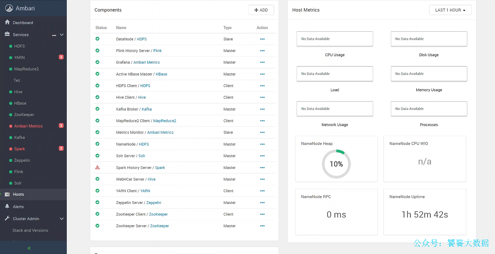
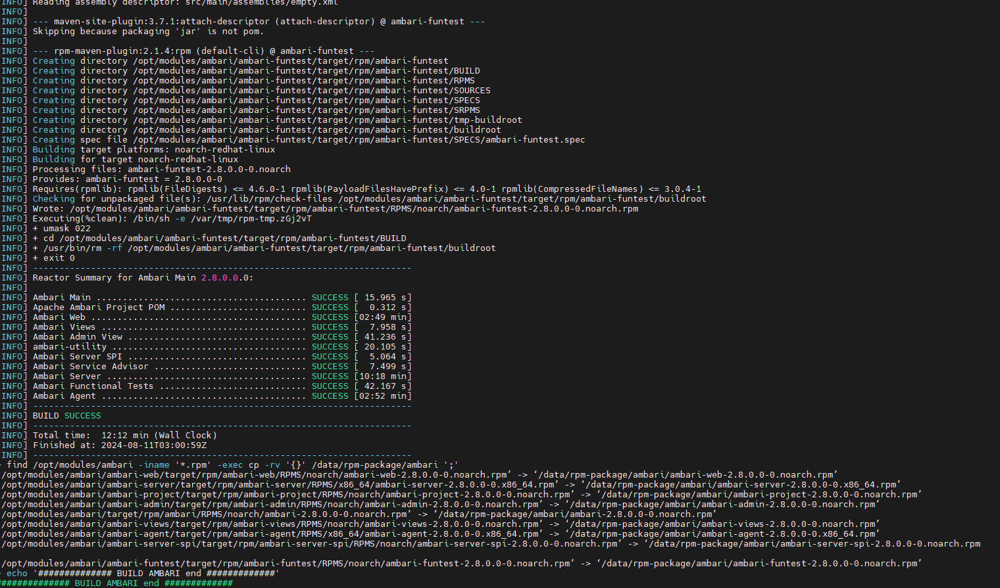
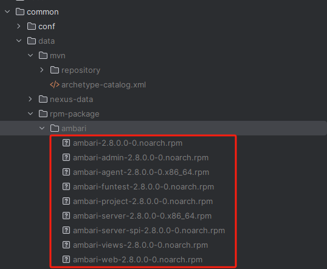
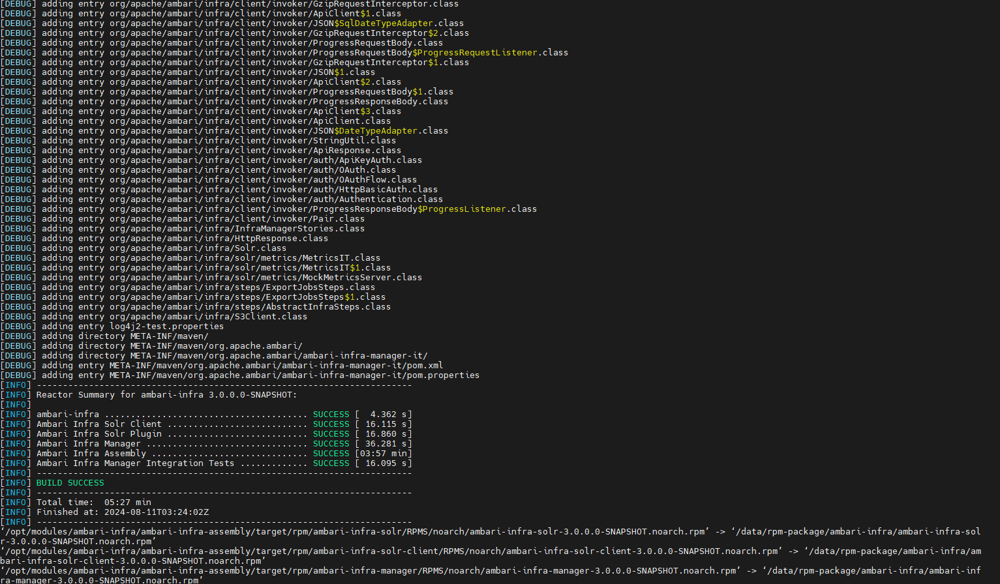
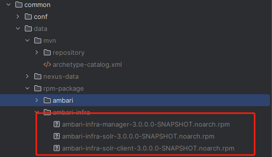
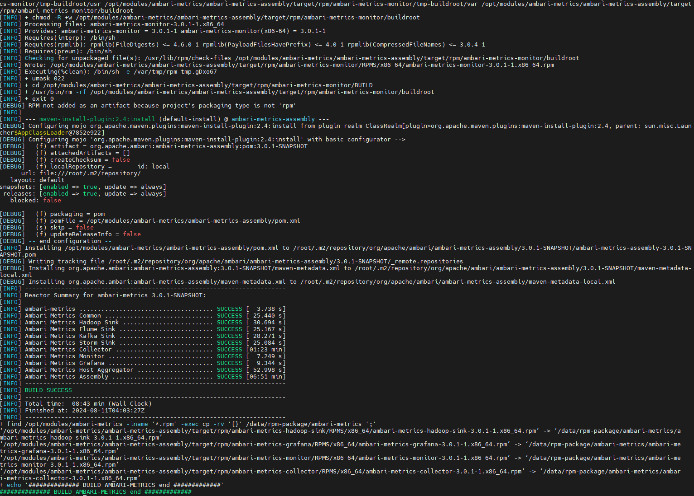
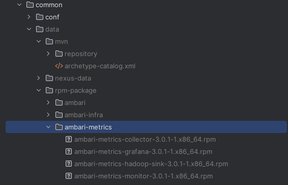
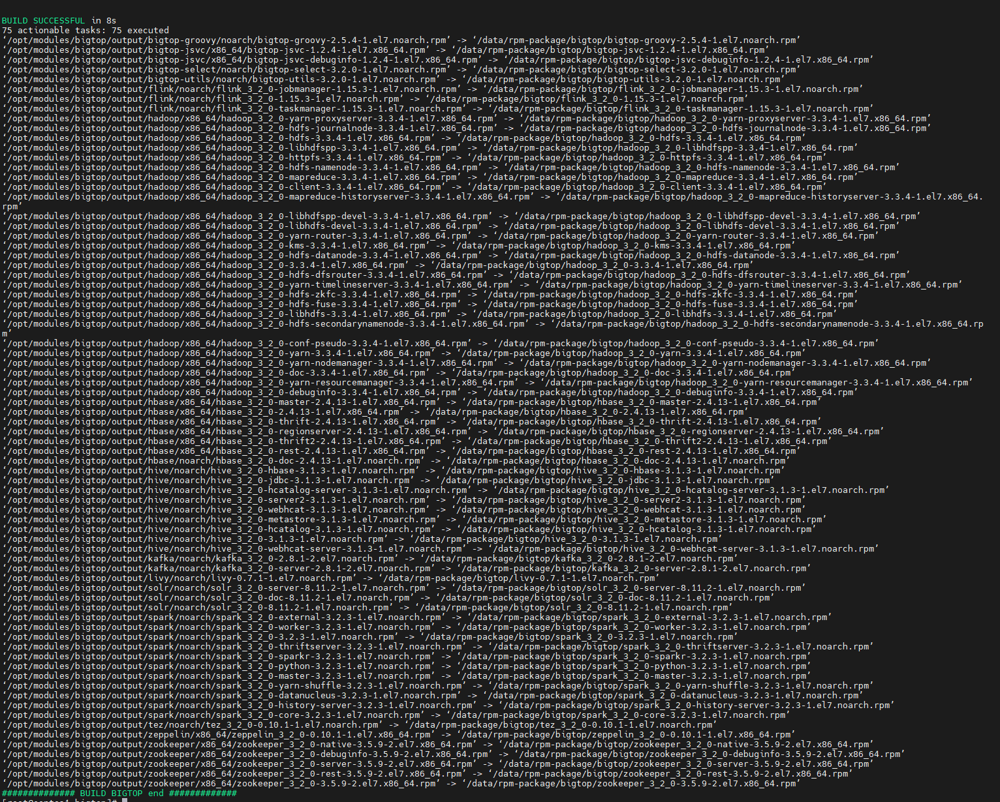
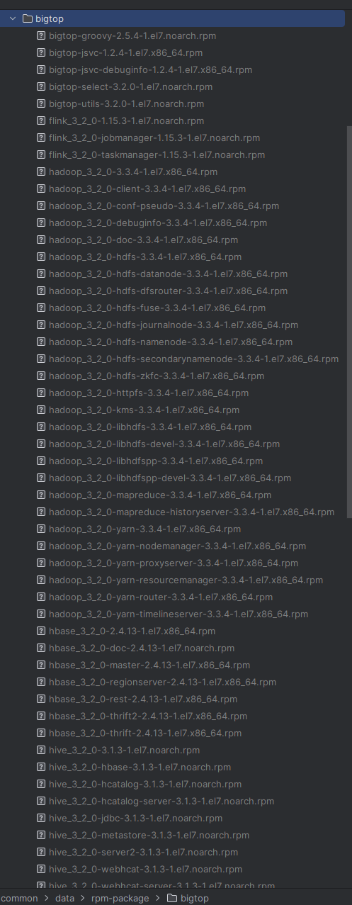
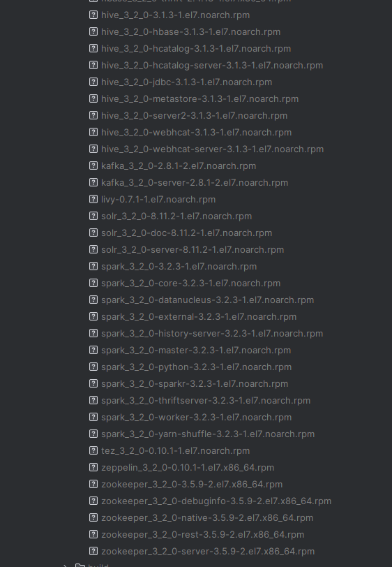

## Ambari+Bigtop 一站式编译和部署解决方案 🚀✨

### 项目简介 📚

本项目旨在提供一个一站式解决方案，从编译到部署 Ambari+Bigtop。通过本项目，用户可以轻松地在各种环境中安装和配置 Ambari 和
Bigtop，简化大数据平台的搭建过程。🌐

### 目录 📑

- [背景](#背景-)
- [功能](#功能-)
- [版本说明](#版本说明)
- [安装](#安装-)
- [使用方法](#使用方法-)
- [贡献](#贡献-)
- [许可证](#许可证-)
- [联系](#联系-)
- [致谢](#致谢-)

### 背景 🌟

本项目结合了 Ambari 和 Bigtop 的优势，提供了一站式的编译和部署解决方案，简化了大数据平台的搭建和运维过程。💡

### 功能 🎯

- 一键编译大数据集群 🖱️
- 提供详细的日志和错误报告 📋
- 未来规划（传统离线数仓、实施数仓）🔮

### 版本说明

- v1.0.2 支持情况

| **组件名称** | **组件版本** | **env版本** | 时间   |
|----------|----------|-----------|------|
| Redis    | 7.4.0    | 1.0.2     | 支持待定 |

- v1.0.1 支持情况

| **组件名称** | **组件版本** | **env版本** | 时间              |
|----------|----------|-----------|-----------------|
| Sqoop    | 1.4.7    | 1.0.1     | 2024/08/15(已支持) |
| Ranger   | 2.4.0    | 1.0.1     | 2024/08/15(已支持) |

- v1.0.0 支持情况

| **组件名称**       | **组件版本**   | **env版本** | 时间              |
|----------------|------------|-----------|-----------------|
| Zookeeper      | 3.5.9      | 1.0.0     | 2024/08/01(已支持) |
| Hadoop         | 3.3.4      | 1.0.0     | 2024/08/01(已支持) |
| Flink          | 1.15.3     | 1.0.0     | 2024/08/01(已支持) |
| HBase          | 2.4.13     | 1.0.0     | 2024/08/01(已支持) |
| Hive           | 3.1.3      | 1.0.0     | 2024/08/01(已支持) |
| Kafka          | 2.8.1      | 1.0.0     | 2024/08/01(已支持) |
| Spark          | 3.2.3      | 1.0.0     | 2024/08/01(已支持) |
| Solr           | 8.11.2     | 1.0.0     | 2024/08/01(已支持) |
| Tez            | 0.10.1     | 1.0.0     | 2024/08/01(已支持) |
| Zeppelin       | 0.10.1     | 1.0.0     | 2024/08/01(已支持) |
| Livy           | 0.7.1      | 1.0.0     | 2024/08/01(已支持) |
| ambari         | branch-2.8 | 1.0.0     | 2024/08/01(已支持) |
| ambari-metrics | branch-3.0 | 1.0.0     | 2024/08/01(已支持) |
| ambari-infra   | master     | 1.0.0     | 2024/08/01(已支持) |



### 安装 🛠️

#### 先决条件 📋

在开始安装之前，请确保您的系统满足以下要求：

| **系统要求** | **描述**                     |
|----------|----------------------------|
| 操作系统     | Linux（推荐 CentOS7.9）🐧      |
| 内存       | 至少 24GB 💾                 |
| 硬盘空间     | 至少 300GB 📦                |
| 网络连接     | 必须 🌐                      |
| 软件       | Docker 和 Docker Compose 🐳 |

**技能要求**：掌握 Linux 命令、Gradle、Maven、Java、前端脚手架等。💻

#### 安装步骤 🚀

1. 克隆本仓库：

   ```bash
   git clone https://gitee.com/janettr/ambari-env.git
   cd ambari-env
   ```

2. 运行 Docker Compose 安装脚本：

   ```bash
   docker-compose -f docker-compose up -d
   ```

### 使用方法 📈

安装完成后，您可以通过以下命令启动和管理您的大数据集群：

```bash
# 进入容器镜像内部

# 方式一
docker exec -it centos1 /bin/bash

# 方式二
ssh root@localhost -p 22223
```

- **编译 Ambari:**

  ```bash
  bash /scripts/build/ambari/build.sh
  ```
  
  

- **编译 Ambari-infra：**

  ```bash
  bash /scripts/build/ambari-infra/build.sh
  ```
  
  

- **编译 Ambari-metrics：**

  ```bash
  bash /scripts/build/ambari-metrics/build.sh
  ```
  
  
- **编译 Bigtop：**

  ```bash
  bash /scripts/build/bigtop/build.sh
  ```
  
  
  

### 贡献 🤝

特别感谢 JaneTTR 对本项目的贡献。👏

### 许可证 📜

本项目采用 [Apache 2.0](LICENSE)。

### 联系 📧

- **项目维护者**：JaneTTR

- **邮箱**：3832514048@qq.com

- **微信公众号**
  

### 致谢 🙏

特别感谢以下资源和工具：

- [Ambari](https://ambari.apache.org/)
- [Bigtop](https://bigtop.apache.org/)

感谢您的关注与支持！🎉 如果您觉得这个项目对您有帮助，欢迎请我喝杯咖啡 ☕，以支持我继续开发和维护这个项目！感激不尽！😊


---
