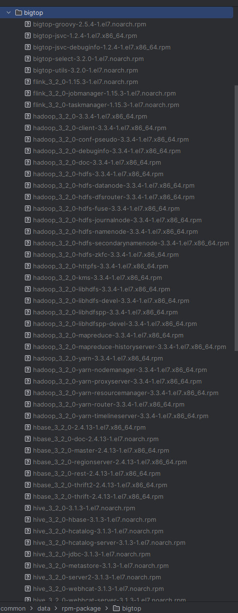

# Ambari+Bigtop 一站式编译和部署解决方案 🚀✨

  
  
   
  
  
  

---

## 最新公告

# Ambari Plus 2.2.3 更新说明｜i18n 与企业级安全链路增强

大家好，我是小饕。

当前最新版本为 **2.2.3**。 本次发布提供两种安装包，基础功能一致，仅分发形式不同。
同时，我们的定制版本正式更名为：

**Ambari Plus**

这个版本的定位依然很明确 ——
在 Ambari 基础上做增强，专注企业安全场景与实际部署问题的修正。

下面是本次版本的主要内容。

## 一、i18n 国际化支持

本次完成前端 i18n 结构改造。

页面支持中英文切换：

本次改造包含：

- 文案抽离
- 组件变量适配
- 结构统一整理

后续扩展其他语言会更方便。

## 二、深色主题

新增两套深色主题。

### 黑金

### 翡翠绿

# 本次完整更新清单

## 新增（Features）

- `[feat]` 新增主题配色方案：**翡翠（Emerald）** 与 **黑金（Black & Gold）** 两套视觉主题，提升整体界面质感与可定制性
- `[feat]` 全面支持 **i18n 国际化机制**，可按需扩展多语言环境，满足不同地区与客户部署需求

## 优化（Optimizations）

- `[optimized]` 优化 **Hadoop DataNode 滚动重启** 异常处理逻辑，修复仅逐个重启导致效率低的问题，提升批量滚动重启稳定性与执行效率
- `[optimized]` 增强 **FreeIPA 用户同步相关参数处理机制**，提升同步稳定性与可控性，适配复杂目录与权限场景
- `[optimized]` 新增 **Ranger Security 日志级别控制权限**，支持按需调整安全日志输出粒度，便于审计与问题排查
- `[optimized]` Ambari 全面增强对 **FreeIPA + Ranger 集成场景** 的授权与认证支持，优化统一身份与权限管理链路，提升企业级安全治理能力
- `[optimized]` Kafka 默认开启 Ranger Plugin 时，自动补全策略必要参数
- `[optimized]` 支持 Ranger 高可用自动生成 keytab 和 principal，也支持后期补全
- `[optimized]` 支持 Ranger 2.4.0 基于 Haproxy 下的高可用部署
- `[optimized]` HDFS 默认管理员组缺省值调整为 `hadoop`，解决 WebHDFS Logs 场景下使用 `admin` 用户仍无法访问的问题
- `[optimized]` Hue 配置中增加默认启动用户与用户组，统一以 `hadoop` 组启动，避免因用户/组不一致导致的启动失败
- `[optimized]` 默认创建 `admin` 用户与 `hadoop` 组，并建立绑定关系，降低初始化与权限配置复杂度
- `[optimized]` ZooKeeper 3.5.9 启用扩展模式（Extended Mode），支持动态配置能力，提升 Ranger Admin 通讯与管理灵活性
- `[optimized]` ZooKeeper 默认连接数相关参数内置，避免高并发访问场景下的隐式性能瓶颈
- `[optimized]` 优化 Ranger Lookup 在快速输入场景下触发大量 timeout task 的问题，降低后台线程池压力
- `[optimized]` Ranger Knox Plugin 调试完成，支持对 Knox Topology 下服务的策略拦截
- `[optimized]` Ranger Admin 支持以客户端模式运行，并携带证书访问受保护服务
- `[optimized]` Hue 增加主题样式渲染能力，提升 Web UI 展示效果与一致性
- `[optimized]` Hue 优化组件日志级别控制，支持按需开启 Debug 级别日志
- `[optimized]` 增强 Hue 配置解析逻辑，避免 SparkSQL 与 Beeswax 模块共用 Hive Principal 引发认证冲突
- `[optimized]` Knox 启用 Kerberos 模式，并补充完整认证脚本，简化安全模式下的部署与验证流程

## 修复（Fix）

- `[fix]` 修复 Kerberos 因 DNS 反解/主机名规范化导致的 principal 不匹配问题（禁用 rdns/canonicalize）
- `[fix]` 修复前端安装组件过多时，滚动条不生效问题
- `[fix]` 修复未开启 kerberos 状态下，Ranger admin 启动校验 zk 失败问题
- `[fix]` 对 Ambari Metrics 监控组件高可用配置进行修改，目前已恢复正常
- `[fix]` 修复 HBase 组件未安装场景下，无法在 Ranger 中创建对应策略的问题
- `[fix]` 修复启用 Ranger Knox Plugin 后，与 Knox 包安装流程存在的冲突问题
- `[fix]` 修复 `hive.tez.java.opts` 因换行符配置不当导致 Tez 引擎执行失败的问题
- `[fix]` 修复 Knox 审计日志无法上传至 HDFS 的问题
- `[fix]` 修复 `ranger-hdfs-plugin` 生成的 `cred.jceks` 为空文件的问题
- `[fix]` 修复 `ranger-yarn-plugin` 生成的 `cred.jceks` 为空文件的问题
- `[fix]` 修复 `ranger-hbase-plugin` 生成的 `cred.jceks` 为空文件的问题
- `[fix]` 修复 `ranger-knox-plugin` 生成的 `cred.jceks` 为空文件的问题
- `[fix]` 修复 `ranger-hive-plugin` 生成的 `cred.jceks` 为空文件的问题
- `[fix]` 修复 Ranger 默认 Cookie Name 配置错误导致的认证异常问题
- `[fix]` 修复 Hue 缺失用户家目录导致的启动异常问题
- `[fix]` 修复 Atlas 在启用 Ranger 与 Kerberos 后，Kafka 权限配置不完整的问题
- `[fix]` 修复 Atlas Kafka 策略中缺失 `ATLAS_HOOK` Topic 必要权限的问题
- `[fix]` 修复 Atlas Kafka 策略中缺失 `consumer group = atlas` 授权的问题
- `[fix]` 修复 Atlas 在安全模式下因缺失 `__AtlasUserProfile` 实体导致的访问异常问题

## 📚 项目简介

> 建议优先访问（更新更快 + 源头首发）  
> 🧭 **[官方文档站](https://doc.janettr.com)**  
> 🚀 [Gitee 镜像站（同步更新）](https://gitee.com/tt-bigdata/ambari-env)

本项目基于以下版本进行魔改与增强，提供一站式编译、部署、管理解决方案：

- **Ambari 2.8.0 & Ambari 3.0.0**
- **Bigtop 3.2.0**

提供 **开箱即用** 的大数据组件部署方案，简化运维，支持多种主流组件，致力于打造稳定、可靠、高效的大数据生态环境。

---

## 🚀 版本说明

|   **版本**   |     **组件名称**     |    **组件版本**    | **env 版本** |             **环境适配**             |
|:----------:|:----------------:|:--------------:|:----------:|:--------------------------------:|
| **v2.2.2** |      Ambari      |     3.0.0      |   2.2.2    | el7 & el8 & ubuntu22 & Kylin V10 |
|            |     Alluxio      |     2.9.4      |   2.2.2    | el7 & el8 & ubuntu22 & Kylin V10 |
|            |       Knox       |     2.1.0      |   2.2.2    | el7 & el8 & ubuntu22 & Kylin V10 |
|            |       Hue        |     4.11.0     |   2.2.2    | el7 & el8 & ubuntu22 & Kylin V10 |
|            |      下面所有组件      |  1.0.0-1.0.7   |   2.2.2    | el7 & el8 & ubuntu22 & Kylin V10 |
| **v2.2.1** |      Ambari      |     3.0.0      |   2.2.1    | el7 & el8 & ubuntu22 & Kylin V10 |
|            |      下面所有组件      |  1.0.0-1.0.7   |   2.2.1    | el7 & el8 & ubuntu22 & Kylin V10 |
| **v2.2.0** |      Ambari      |     3.0.0      |   2.2.0    | el7 & el8 & ubuntu22 & Kylin V10 |
|            |      下面所有组件      |  1.0.0-1.0.7   |   2.2.0    | el7 & el8 & ubuntu22 & Kylin V10 |
| **v2.1.0** |      Ambari      |     3.0.0      |   2.1.0    |       el7 & el8 & ubuntu22       |
|            |      下面所有组件      |  1.0.0-1.0.7   |   2.1.0    |       el7 & el8 & ubuntu22       |
| **v2.0.0** |      Ambari      |     3.0.0      |   2.0.0    |            el7 & el8             |
|            |      下面所有组件      |  1.0.0-1.0.7   |   2.0.0    |            el7 & el8             |
| **v1.0.7** |     Superset     |     4.1.2      |   1.0.7    |              仅 el7               |
|            |      Atlas       |     2.4.0      |   1.0.7    |              仅 el7               |
|            |      Spark       |  3.5.5（版本升级）   |   1.0.7    |              仅 el7               |
|            |      Flink       |  1.17.2（版本升级）  |   1.0.7    |              仅 el7               |
| **v1.0.6** |      Trino       |      474       |   1.0.6    |              仅 el7               |
|            |       Hudi       |     1.1.0      |   1.0.6    |              仅 el7               |
|            |      Paimon      |     1.0.1      |   1.0.6    |              仅 el7               |
| **v1.0.5** |      Ozone       |     1.4.1      |   1.0.5    |              仅 el7               |
|            |      Impala      |     4.4.1      |   1.0.5    |              仅 el7               |
|            |   Nightingale    |     7.7.2      |   1.0.5    |              仅 el7               |
|            |     Categraf     |     0.4.1      |   1.0.5    |              仅 el7               |
|            | VictoriaMetrics  |    1.109.1     |   1.0.5    |              仅 el7               |
|            |   Cloudbeaver    |     24.3.3     |   1.0.5    |              仅 el7               |
|            |     Celeborn     |     0.5.3      |   1.0.5    |              仅 el7               |
| **v1.0.4** |      Doris       |     2.1.7      |   1.0.4    |              仅 el7               |
| **v1.0.3** |     Phoenix      |     5.1.2      |   1.0.3    |              仅 el7               |
|            | Dolphinscheduler |     3.2.2      |   1.0.3    |              仅 el7               |
| **v1.0.2** |      Redis       |     7.4.0      |   1.0.2    |              仅 el7               |
| **v1.0.1** |      Sqoop       |     1.4.7      |   1.0.1    |              仅 el7               |
|            |      Ranger      |     2.4.0      |   1.0.1    |              仅 el7               |
| **v1.0.0** |    Zookeeper     |     3.5.9      |   1.0.0    |              仅 el7               |
|            |      Hadoop      |     3.3.4      |   1.0.0    |              仅 el7               |
|            |    ~~Flink~~     |   ~~1.15.3~~   |   1.0.0    |              仅 el7               |
|            |      HBase       |     2.4.13     |   1.0.0    |              仅 el7               |
|            |       Hive       |     3.1.3      |   1.0.0    |              仅 el7               |
|            |      Kafka       |     2.8.1      |   1.0.0    |              仅 el7               |
|            |    ~~Spark~~     |   ~~3.2.3~~    |   1.0.0    |              仅 el7               |
|            |       Solr       |     8.11.2     |   1.0.0    |              仅 el7               |
|            |       Tez        |     0.10.1     |   1.0.0    |              仅 el7               |
|            |     Zeppelin     |     0.10.1     |   1.0.0    |              仅 el7               |
|            |       Livy       |     0.7.1      |   1.0.0    |              仅 el7               |
|            |    ~~Ambari~~    | ~~branch-2.8~~ |   1.0.0    |              仅 el7               |
|            |  Ambari Metrics  |   branch-3.0   |   1.0.0    |              仅 el7               |
|            |   Ambari Infra   |     master     |   1.0.0    |              仅 el7               |

---

## 🔧 快速上手

[参考文档](https://doc.janettr.com)

教你如何安装，如何卸载，并提供了一键安装脚本

## 效果图

---

## ❤️ 支持本项目

如果你觉得本项目对你有帮助，可以通过以下方式支持：

1. ⭐ **Star** 本项目，帮助它被更多人看到 🚀
2. 📢 **分享** 本项目，帮助更多开发者受益
3. 🍵 **打赏**，请作者喝一杯茶 ☕（见下方二维码）

|                    微信赞赏                    |                          微信号                           |                        QQ 群                        |                
|:------------------------------------------:|:------------------------------------------------------:|:--------------------------------------------------:|
|  |  |  |

---

## 📜 许可证

本项目采用 [Apache 2.0](LICENSE) 许可证。

---

这个脚本是 x86 里的 scripts/system/init/kylin10/setup_r_env.sh ，你要帮我在 arm 上执行一个配套的，也确保成功，涉及到下载 包的，你可以下载到我本机，然后scp 过去，服务器慢。                       
你试验成功以后，需要把最终完整的脚本 记录下来，写到 no_docker_scripts/arm64 就叫，final.sh 吧 
