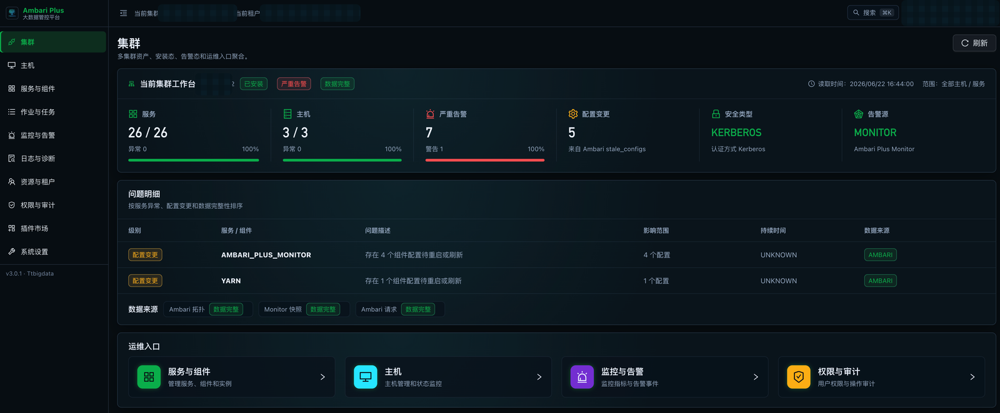
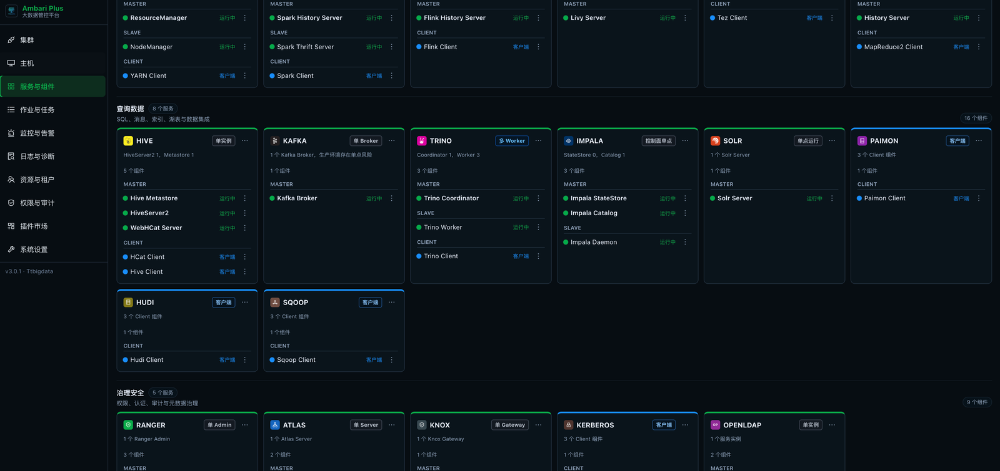
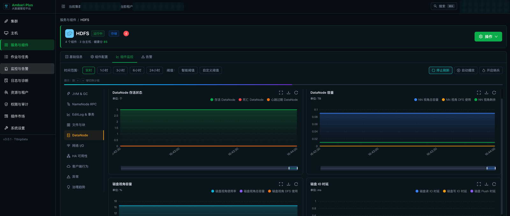
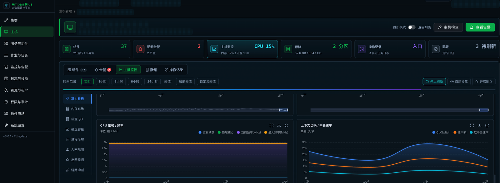
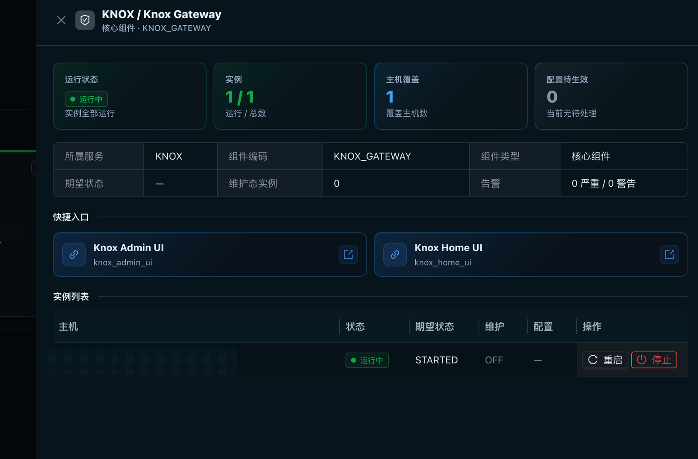
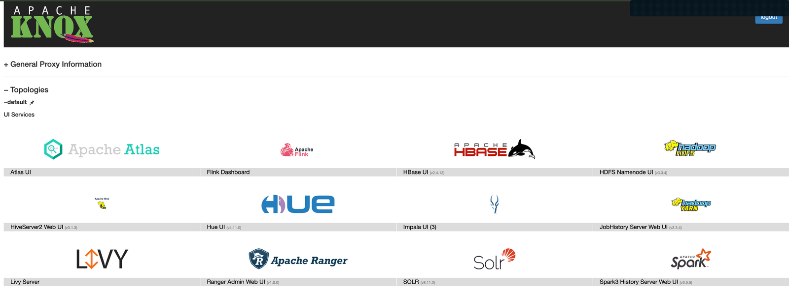
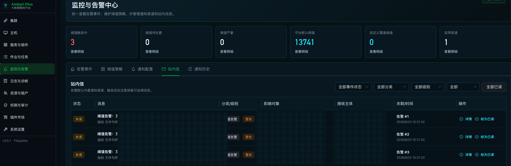

# Ambari Plus 3.0.1 一站式编译、部署与运维环境

<p align="center">
  <a href="https://gitee.com/tt-bigdata/ambari-env">
    
  </a>
  <a href="https://opensource.org/licenses/Apache-2.0">
    
  </a>
  <br>
  
  
  
</p>

---

## Ambari Plus 3.0.1

**Ambari Plus 3.0.1** 基于 Ambari 3.0.0 和 Bigtop 3.2.0，面向自建大数据集群的构建、安装、扩展与运维。

它保留 Ambari 的服务安装与配置管理能力，同时补齐统一控制台、服务详情、主机监控、告警闭环、权限审计、Knox 网关、插件市场和离线升级等生产环境常用能力。



> 页面截图已对主机名、IP、账号、租户和集群标识等环境信息做脱敏处理。

## 适合哪些场景

- 在 el7、el8、Ubuntu 22.04、Kylin V10 等环境中构建 Ambari 和 Bigtop 组件包。
- 在 Ambari 基础上补充统一控制台、服务详情、主机诊断和监控告警能力。
- 打通 Kerberos、Ranger、Knox、LDAP、Hue 等安全访问链路。
- 在离线或内网环境中交付、升级和维护大数据组件。

## 3.0.1 带来的能力

| 方向 | 说明 |
| --- | --- |
| 控制台 | 通过 Ambari Plus Web 管理集群、主机、服务、任务、告警、权限、插件、设置和版本更新。 |
| 服务详情 | HDFS、YARN、Kafka、Hive、HBase、Knox 等服务按各自运维视角展示关键指标。 |
| Monitor v2 | 通过 `monitor-agent`、`monitor-ingester`、`monitor-platform-api`、`monitor-rule-engine` 形成监控采集、入库、API 和规则计算链路。 |
| 告警中心 | 支持阈值策略、告警事件、通知渠道、站内信、通知历史和 Ambari 原生告警接入。 |
| 权限审计 | 提供权限包、资源绑定、预检、部署、运行态验证、闭环验收和审计中心。 |
| 安全链路 | 增强 LDAP、Kerberos、Ranger、Knox、Hue 等组合场景，降低安全模式下的配置成本。 |
| 插件体系 | 支持插件市场、插件宿主、插件上传、启停、反代、License 和 LLM Gateway 示例插件。 |
| 离线升级 | 支持升级包上传、manifest 解析、preflight、执行计划、进度跟踪和回滚准备。 |

## 从总览到服务

集群工作台先给出服务、主机、严重告警、配置变更、安全类型和告警源等核心状态。进入服务目录后，可以按存储、计算、查询、治理、安全、接入等场景查看组件实例、角色、运行状态和客户端分布。



## 服务详情与主机诊断

服务详情页按组件类型呈现不同的运维视角。以 HDFS 为例，页面会突出 DataNode、NameNode、容量、RPC、文件与块、HA、异常和治理趋势等关键指标。



主机页把组件、告警、主机监控、存储、操作记录和配置放在同一个视图里。CPU、内存、磁盘、网络、进程、链路等指标可以按时间窗口查看，适合快速判断问题是在服务层、主机层还是配置层。



## Knox 网关

Knox 是安全访问链路的核心入口之一。它负责把 Ranger、Hue、Atlas、YARN UI、Spark History、Trino UI 等 Web 能力收敛到统一网关路径下，并与 Kerberos、Ranger Plugin、Knox SSO 等配置联动。



Knox Home UI 会把已接入的组件入口集中展示出来，减少直接暴露组件原始地址，也方便后续做统一认证、审计和访问控制。



## 监控与告警中心

告警中心将告警事件、阈值策略、通知配置、站内信和通知历史放到同一个入口里。告警不只是页面提示，还可以追踪来源、级别、状态、影响对象和通知链路。



## 离线版本更新

生产环境常常不能直接联网升级。离线版本更新入口支持上传升级包，并按解析、预检、确认、执行和回滚准备的流程推进。


## 仓库内容

`ambari-env` 为 Ambari Plus 提供构建、打包和部署所需的基础环境，主要包含：

- Docker 化构建环境和本地 Nexus 缓存。
- Ambari、Bigtop、Ambari Metrics、Ambari Infra 构建脚本。
- CentOS/Rocky/Ubuntu/Kylin 多发行版适配。
- Kylin V10 x86/ARM64 构建与裸机部署脚本。
- Ambari Plus 3.0.1 发行包构建、验证和交付基础。

更多安装、卸载、组件说明和版本更新记录可参考：

- 官方文档站：[https://doc.janettr.com](https://doc.janettr.com)
- Gitee 镜像站：[https://gitee.com/tt-bigdata/ambari-env](https://gitee.com/tt-bigdata/ambari-env)

## 版本说明

| 版本 | 核心定位 | Ambari | Bigtop | 主要环境 |
| --- | --- | --- | --- | --- |
| 3.0.1 | 控制台、监控、权限、Knox、插件、离线升级完整增强版 | 3.0.0 | 3.2.0 | el7 / el8 / Rocky 8 / Ubuntu 22.04 / Kylin V10 x86 / Kylin V10 ARM64 |
| 2.2.3 | i18n、主题、安全链路与企业部署增强 | 3.0.0 | 3.2.0 | el7 / el8 / Ubuntu 22.04 / Kylin V10 |
| 2.2.x | Ambari 3.0.0 与多系统适配增强 | 3.0.0 | 3.2.0 | el7 / el8 / Ubuntu 22.04 / Kylin V10 |
| 2.0.x | Ambari 3.0.0 基础构建版本 | 3.0.0 | 3.2.0 | el7 / el8 |
| 1.0.x | Bigtop 组件持续扩展版本 | 2.8 / 3.0 过渡 | 3.2.0 | 以 el7 为主 |

## 权益与组件版本

不同使用计划包含的组件范围不同。下表列出当前可用版本和组件版本，便于在下载或部署前确认所需能力。

### 当前发行版本

| 类型 | 版本 | 主要系统与架构 |
| --- | --- | --- |
| Ambari Plus | v3.0.1 / Ambari 3.0.0 | el7 / el8 / ubuntu22 / kylin v10 x86_64 / aarch64 |
| Ambari Plus Monitor | v3.0.1 | el8 / ubuntu22 / kylin v10 x86_64 / aarch64 |
| Bigtop 组件包 | BIGTOP 3.2.0 / env 3.0.1 | el7 / el8 / ubuntu22 / kylin v10 x86_64 / aarch64 |

### FREE 计划

FREE 计划包含基础大数据组件，适合学习、验证和小范围评估；入会尊享同样包含这些组件。

| 组件 | 版本 |
| --- | --- |
| Ambari | 3.0.0 |
| Hadoop | 3.3.4 |
| HBase | 2.4.13 |
| Hive | 3.1.3 |
| Phoenix | 5.1.2 |
| ZooKeeper | 3.5.9 |
| Tez | 0.10.1 |
| Solr | 8.11.2 |

### 入会尊享扩展

入会尊享扩展包含生产环境更常用的监控、安全治理、计算、湖仓和工具组件。

| 组件 | 版本 |
| --- | --- |
| Ambari Plus Monitor | 3.0.1 |
| Superset | 4.1.2 |
| Alluxio | 2.9.4 |
| Hue | 4.11.0 |
| Knox | 2.1.0-RC2 |
| Atlas | 2.4.0 |
| Spark | 3.5.5 |
| Flink | 1.17.2 |
| Trino | 474 |
| Hudi | 1.1.0 |
| Paimon | 1.0.1 |
| Ozone | 1.4.1 |
| Impala | 4.4.1 |
| Celeborn | 0.5.3 |
| Doris | 2.1.7 |
| DolphinScheduler | 3.4.1 |
| Sqoop | 1.4.7 |
| Ranger | 2.4.0 |
| Kafka | 2.8.1 |
| Zeppelin | 0.10.1 |
| Livy | 0.7.1 |

## 目录结构

```text
scripts/
  build/
    ambari/           # Ambari 2.x/早期构建脚本
    ambari3/          # Ambari 3.x 构建与 patch
    ambari-infra/     # Ambari Infra 构建
    ambari-metrics/   # Ambari Metrics 构建
    bigtop/           # Bigtop 1.x/早期组件构建
    bigtop3/          # Bigtop 3.x 多系统组件构建
  system/
    init/             # 系统初始化脚本
    before/           # 构建前置准备
    after/            # 构建后处理
  util/               # 工具脚本
  master_*.sh         # 各发行版容器初始化入口

no_docker_scripts/    # 裸机部署脚本
plugin/               # 可选插件或周边服务
common/               # Maven、Gradle、YUM repo 等公共配置
```

## 支持本项目

如果这个项目对你有帮助，可以通过这些方式支持：

1. 给项目点一个 Star，让更多人看到它。
2. 分享给正在折腾 Ambari、Bigtop、大数据集群部署的朋友。
3. 请作者喝杯茶，二维码在下面。

| 微信赞赏 | 微信号 | QQ 群 |
| --- | --- | --- |
|  |  |  |

## 许可证

本项目采用 [Apache 2.0](LICENSE) 许可证。
